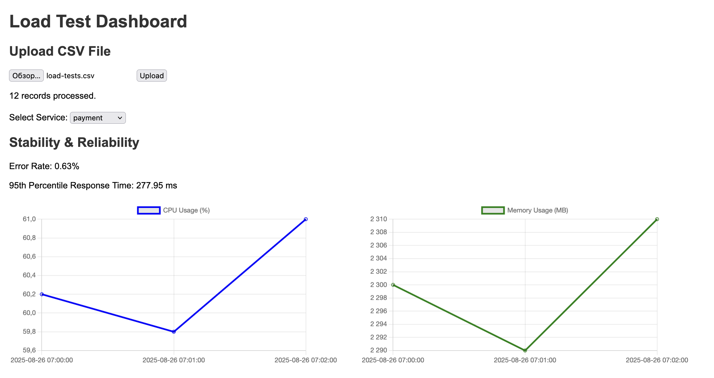

# devops-diploma-iutkov
## Load Test Analysis Dashboard
Проект для анализа результатов нагрузочного тестирования сервисов. Приложение позволяет загружать CSV-файл с данными нагрузочного тестирования разных сервисов и визуализировать статистику и использование ресурсов в дашборде. Имеется REST API на FastAPI и простой фронтенд с графиками. Также поддерживается выгрузка отчётов в Amazon S3.

### Функционал
Загрузка файла с результатами нагрузочного тестирования (пример файла - `example.csv`). После загрузки на главной странице должны появиться метрики
. Итоговый отчет можно выгрузить в AWS S3

### Переменные окружения для AWS S3 
- AWS_ACCESS_KEY_ID
- AWS_SECRET_ACCESS_KEY
- AWS_BUCKET_NAME
- AWS_REGION